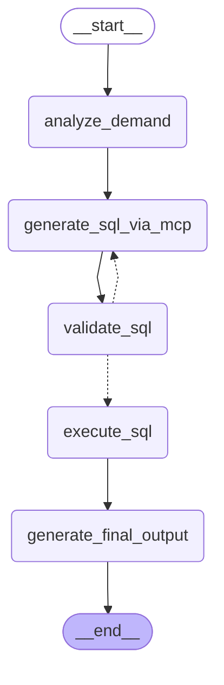

# 智能BI工作流

```mermaid
---
config:
  flowchart:
    curve: linear
---
graph TD;
	__start__([<p>__start__</p>]):::first
	analyze_demand(analyze_demand)
	generate_sql_via_mcp(generate_sql_via_mcp)
	validate_sql(validate_sql)
	execute_sql(execute_sql)
	generate_final_output(generate_final_output)
	__end__([<p>__end__</p>]):::last
	__start__ --> analyze_demand;
	analyze_demand --> generate_sql_via_mcp;
	execute_sql --> generate_final_output;
	generate_sql_via_mcp --> validate_sql;
	validate_sql -.-> execute_sql;
	validate_sql -.-> generate_sql_via_mcp;
	generate_final_output --> __end__;
	classDef default fill:#f2f0ff,line-height:1.2
	classDef first fill-opacity:0
	classDef last fill:#bfb6fc

```